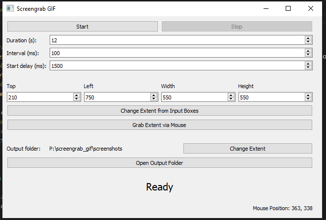

# screengrab_gif
A bit like windows snipping tool, but captures gifs.

## Installation
``` bash
pip install screen-grab
```
If that doesn't work...
``` PowerShell
# On Win10, 3.11.2 64-bit, VS Code
# Set up a virtual environment
mkdir .venv
cd .venv
path/to/python.exe -m venv .
# Activate the virtual environment
.\Scripts\Activate.ps1
# You may need to mess about with permissions, but this is more general virtual environment stuff
# Install dependencies
pip install pywin32
pip install imageio
pip install PyQt5
# Run the program
path/to/python.exe -m screen_grab
```

<!-- images -->
## Examples


